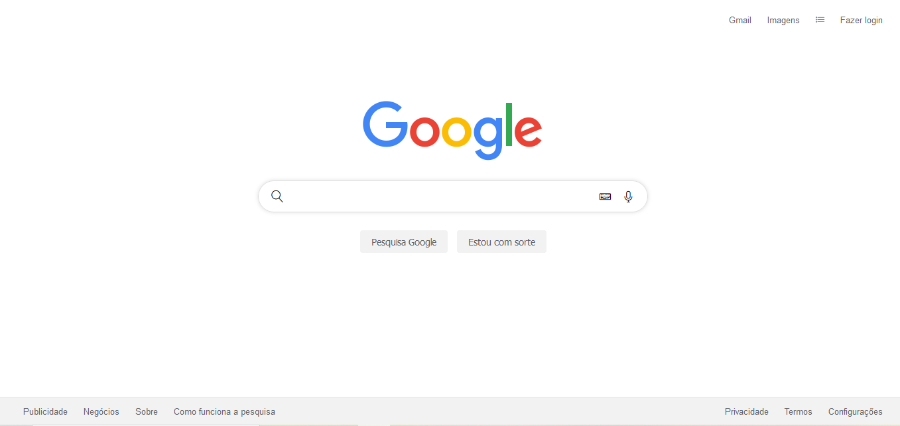

<h1 align="center">google-clone</h1>

<h1 align="center">
    
</h1>

<h4 align="center"> 
	🚧  google-clone 🚀 concluído  🚧
</h4>

## Sobre o projeto

Clone da página do Google feito nas aulas de html e css do Hora de Codar

### 🛠 Tecnologias

HTML5, CSS3

### IDE

- [Visual Studio Code](https://code.visualstudio.com/)

## 🦸 Autor
<h4 align="center">
  Feito com ❤️ por nelynely 👋️ <a href="https://www.linkedin.com/in/f-nely/">Entre em contato!</a>
</h4>

